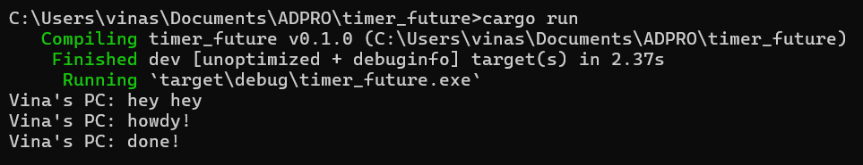
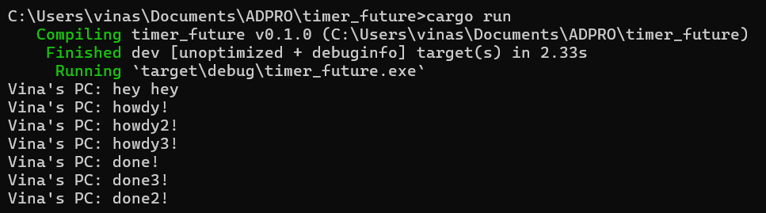

# Tutorial 10 (TIMER)
Nama: Vina Myrnauli Abigail Siallagan 
NPM: 2206825776 
Kelas: Pemrograman Lanjut - A 

---
## REFLEKSI 1

###### 1.2. Understanding how it works.
  
* Fungsi *async* beroperasi secara terpisah dari fungsi utama yang memanggilnya. Ini mengindikasikan bahwa eksekusi fungsi *async* tidak tergantung pada eksekusi fungsi utama yang memanggilnya. Dikarenakan sifatnya yang asinkron, urutan *output* dari *program* dapat berubah.
* Ada kemungkinan bahwa kode di luar fungsi async dieksekusi sebelum fungsi *async* selesai, mengubah urutan *output* yang diharapkan.
* Pada saat saya melakukan `cargo run`, "hey hey" bisa muncul sebelum "howdy!" dan "done!". Ini disebabkan oleh pernyataan `println!("hey hey");` terletak di luar fungsi *async*, yang berarti akan dijalankan secara independen dari eksekusi fungsi *async*.
 

###### 1.3. Multiple Spawn and removing drop.
 
* Adanya lebih banyak *spawner* menyebabkan peningkatan jumlah tugas yang dieksekusi. Ini disebabkan oleh banyaknya tugas yang ditambahkan ke dalam antrian pesan oleh pengirim tugas.
* Ketidakhapusan *spawner* mengakibatkan program tidak pernah berhenti karena diasumsikan masih ada transmisi data dari *spawner*. `drop(spawner)` menandakan bahwa interaksi telah selesai dan *spawner* akan ditutup.
* Saat *spawner* memanggil fungsi `spawn`, itu menghasilkan tugas baru yang dikirimkan ke dalam pengirim tugas.
* Eksekutor akan mengambil satu tugas dari pengirim tugas dan menjalankannya. Selanjutnya, eksekutor akan mengambil tugas lain dari antrian hingga seluruh tugas selesai.
* Penghapusan *spawner* dengan `drop(spawner)` menunjukkan bahwa interaksi telah selesai. Ketika semua tugas telah dieksekusi dan *spawner* di-*drop*, itu menunjukkan bahwa interaksi telah selesai.